#  YAUC

YAUC is an android app helping you to keep up-to-date
with [Unsplash | Free high-resolution photos](https://unsplash.com/new).

## Features

* list of new photos
* fetch updates from [Unsplash API](https://unsplash.com/documentation) at regular intervals
* notify user about new photos
* list of favorites and own photos for joined (and authenticated) users of [Unsplash](https://unsplash.com/join)
* detail view in "full screen"
* about photo with information of author, exif data and location
* editing of own photos

## Requirements

* Android 4.4

## Screens

[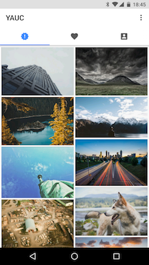](docs/Phone_NewPhotos.png)
[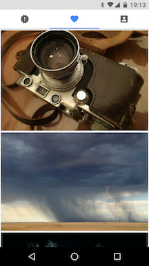](docs/Phone_Favorites.png)
[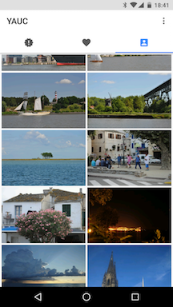](docs/Phone_OwnPhotos.png)
[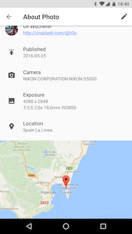](docs/Phone_AboutPhoto.png)
[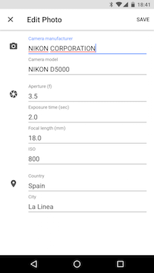](docs/Phone_EditPhoto.png)
[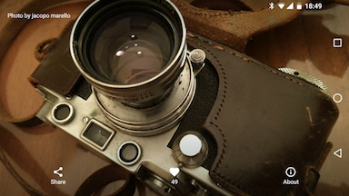](docs/Phone_Detail.png)

[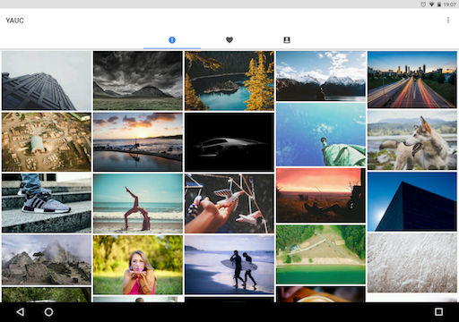](docs/Tablet_NewPhotos.png)
[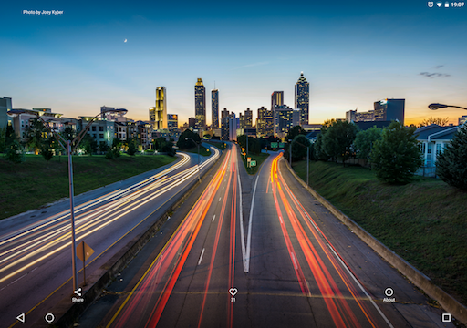](docs/Tablet_Detail_Landscape.png)
[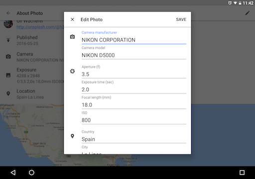](docs/Tablet_EditPhoto.png)

[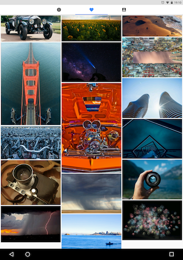](docs/Tablet_Favorites.png)
[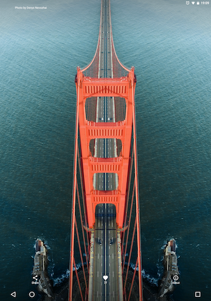](docs/Tablet_Detail_Portrait.png)

## License

YAUC is released under the MIT License see [LICENCE](LICENSE)
